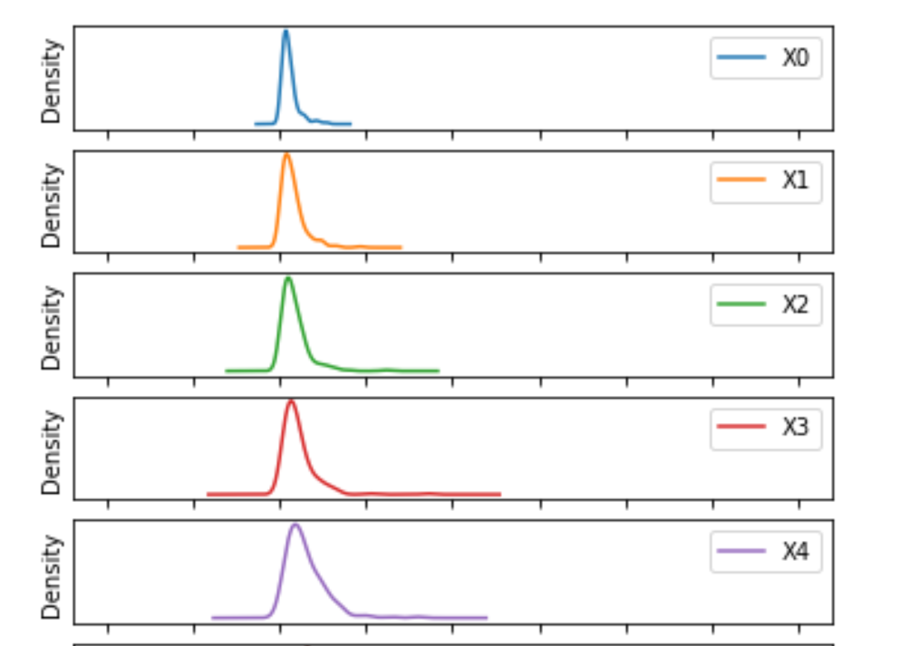

# SONAR Mine v/s Rock Dataset

*The original dataset is available [here](https://www.kaggle.com/ypzhangsam/sonaralldata)*

There are 208 observations with 60 input variables and 1 output variable 'R' (Rock) or 'M' (Mine).

The following figures were plotted while performing *Exploratory Data Analysis* on the dataset.

### Boxplot:

### Andrew Curves:

### Density Plots:

<table><tr>
<td>  </td>
<td>  </td>
</tr></table>

