# SONAR Mine v/s Rock Dataset

*The original dataset is available [here](https://www.kaggle.com/ypzhangsam/sonaralldata)*

There are 208 observations with 60 input variables and 1 output variable 'R' (Rock) or 'M' (Mine).

The following figures were plotted while performing *Exploratory Data Analysis* on the dataset.

### Boxplot:
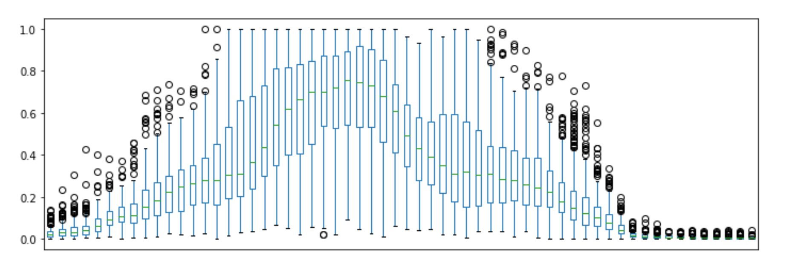

### Andrew Curves:
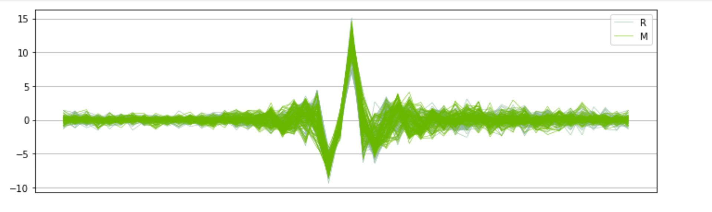

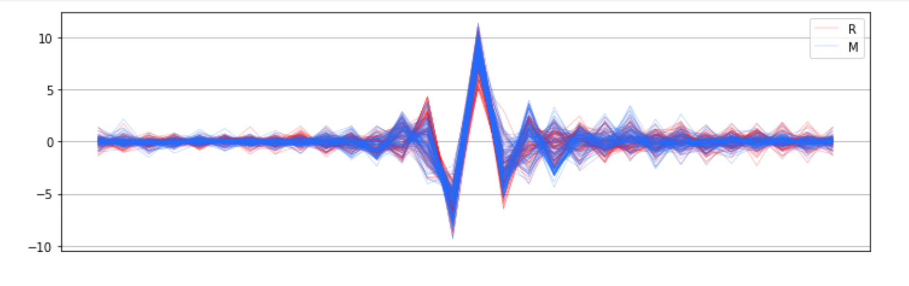

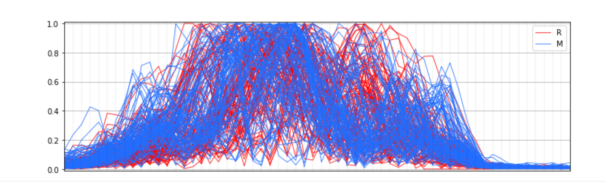

### Density Plots:

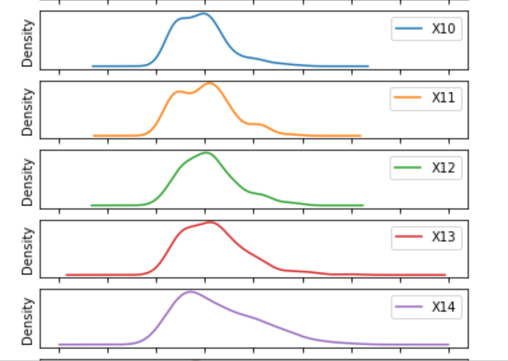
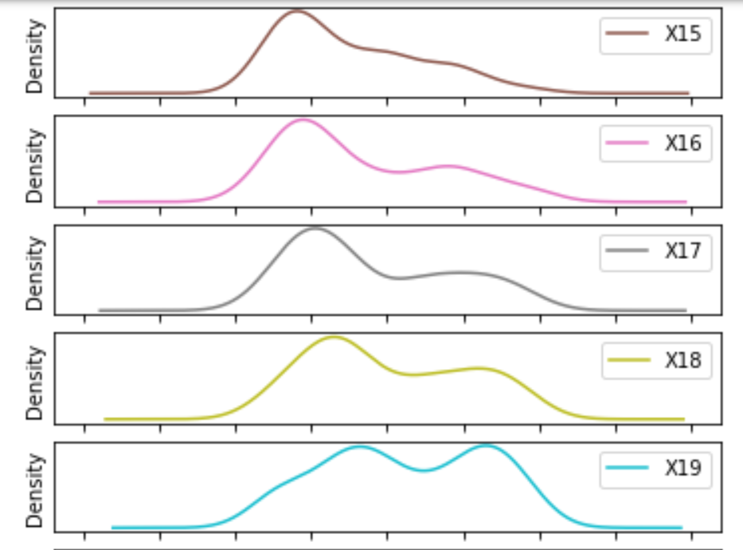
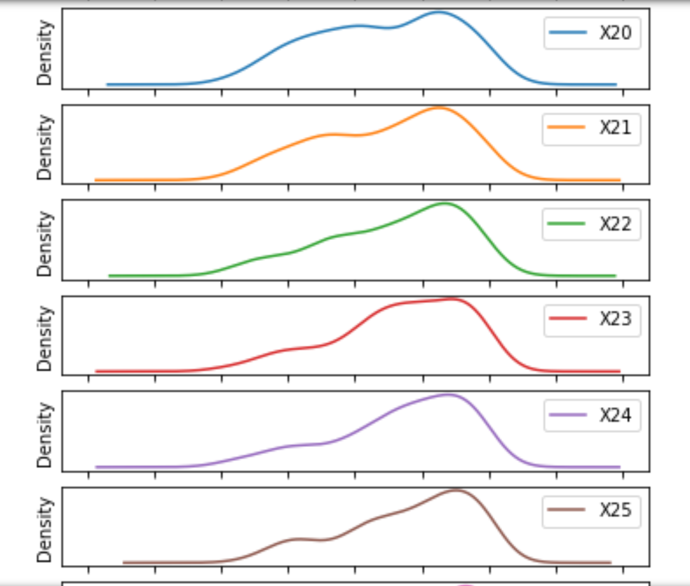

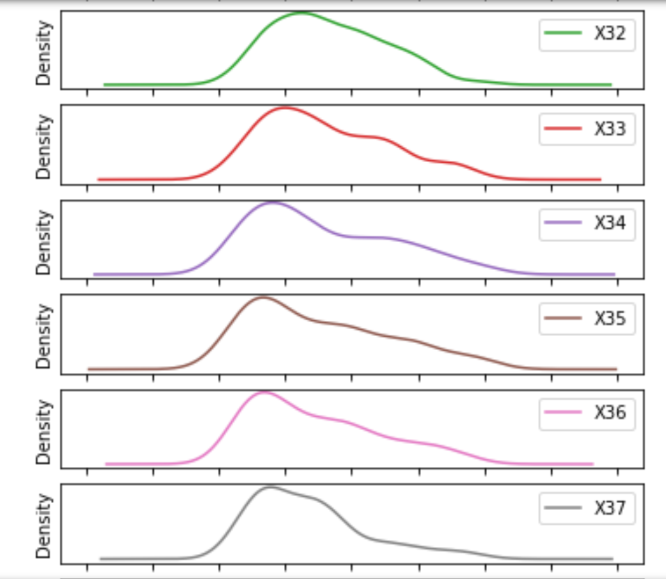
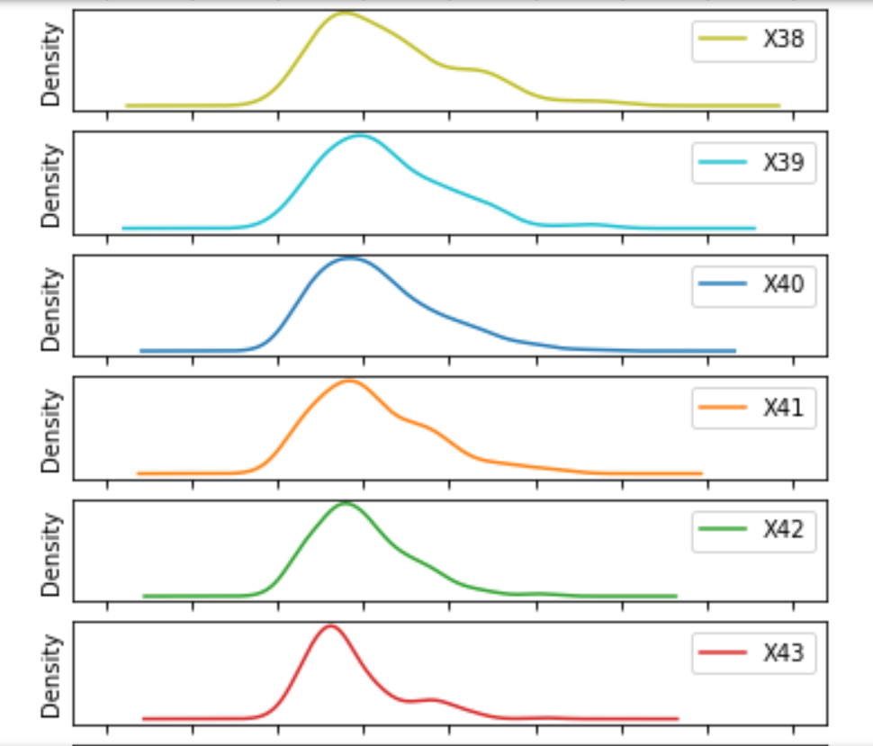
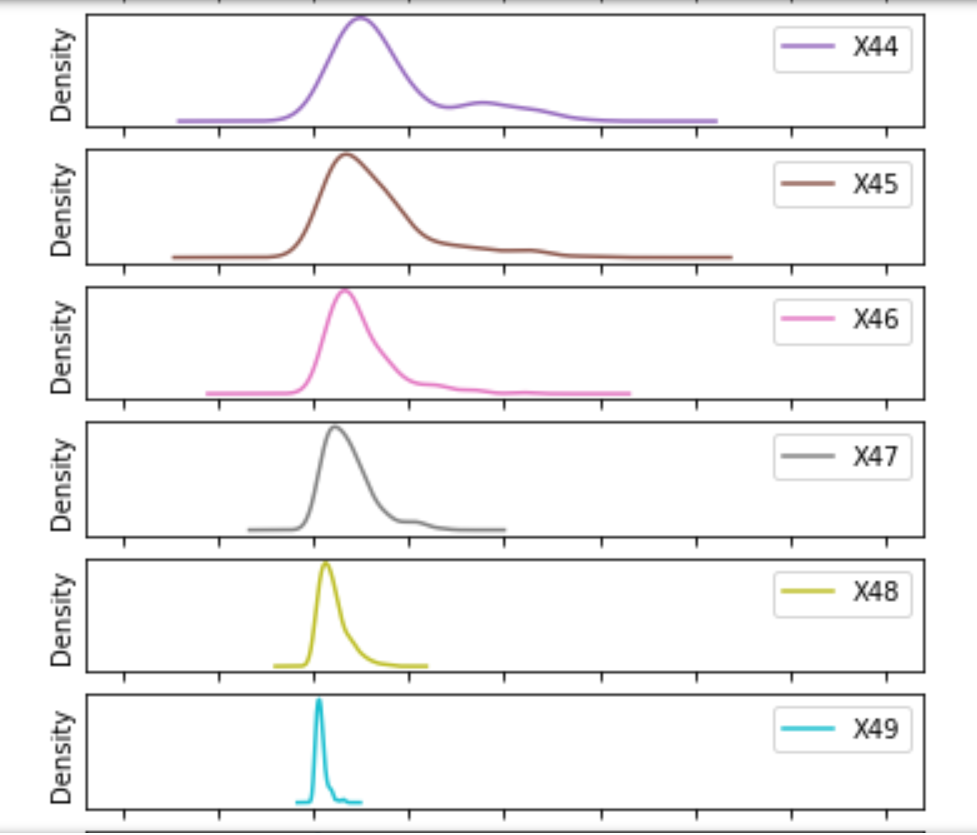
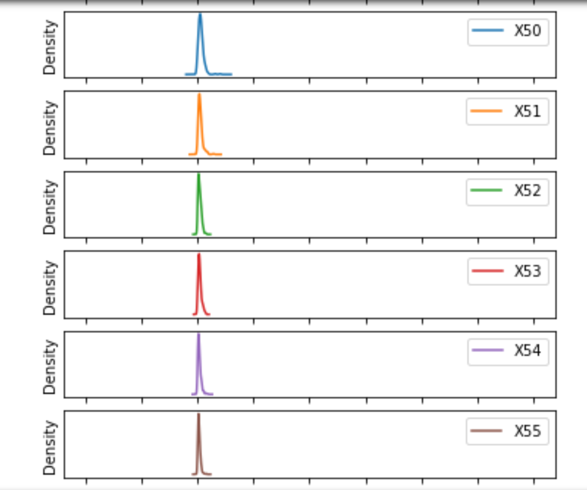
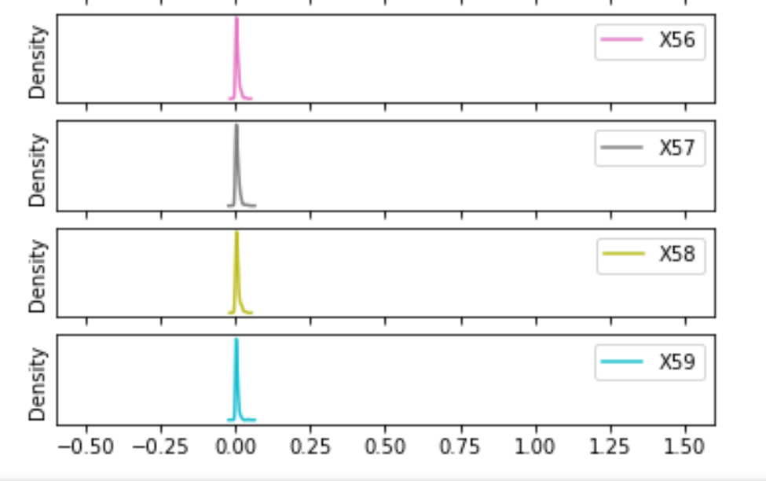
